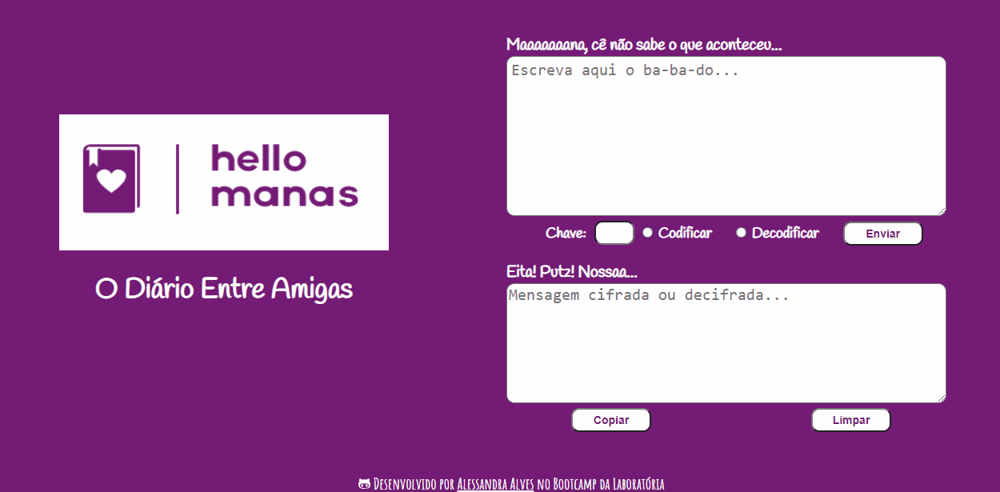

# Cifra de César em HELLO MANAS!

  

### Introdução 🔐

Cifrar significa codificar. A [cifra de
César](https://pt.wikipedia.org/wiki/Cifra_de_C%C3%A9sar) é um dos primeiros
tipos de criptografias conhecidas na história. O imperador romano Júlio César
utilizava essa cifra para enviar ordens secretas aos seus generais no campo de
batalha.

A cifra de César é uma das técnicas mais simples de cifrar uma mensagem. É um
tipo de cifra por substituição, em que cada letra do texto original é
substituida por outra que se encontra há um número fixo de posições
(deslocamento) mais a frente do mesmo alfabeto.

Por exemplo se usarmos o deslocamento (_offset_) de 3 posições:

* Alfabeto sem cifrar: A B C D E F G H I J K L M N O P Q R S T U V W X Y Z
* Alfabeto com cifra:  D E F G H I J K L M N O P Q R S T U V W X Y Z A B C
* A letra A será D
* A palavra CASA será FDVD

Atualmente todas as cifras de substituição alfabética simples, são decifradas
com facilidade e não oferecem muita segurança na comunição, mas a cifra de César
muitas vezes pode fazer parte de um sistema mais complexo de criptografia, como
a cifra de Vigenère, e tem aplicação no sistema ROT13.

### Sobre 📓

O Hello Manas é uma página recém criada em forma de diário, para mulheres e 
para todas que se definam como tal, com a intenção de interagir e compartilhar seus
momentos com as amigas, contar segredos, desabafar, pedir conselhos e enfim, ter todo
aquele suporte de uma amizade verdadeira e de forma segura. 
Pensando nessa segurança e eficácia, a mensagem é cifrada pela usuária e seu grupo de 
amigas recebem uma chave para decifrar essa mensagem e fazer essa interação.

### Ferramentas 🛠️

* HTML5
* CSS3
* Vanilla JavaScript

### Interface do usuário (UI) 🖌️

A interface deve permitir ao usuário:

* Eleger um _offset_ indicando quantas posições de deslocamento de caracteres
  quer que a cifra utilize.
* Inserir uma mensagem (texto) para ser cifrada.
* Ver o resultado da mensagem cifrada.
* Inserir uma mensagem (texto) para ser decifrada.
* Ver o resultado da mensagem decifrada.
* Interface para desktop.

### Resultado final da Interface 💻

### Experiência do Usuário

Vamos testar? [Clique aqui] 🎉

### Autora

[Github](https://github.com/ale-alves) | Alessandra Alves

